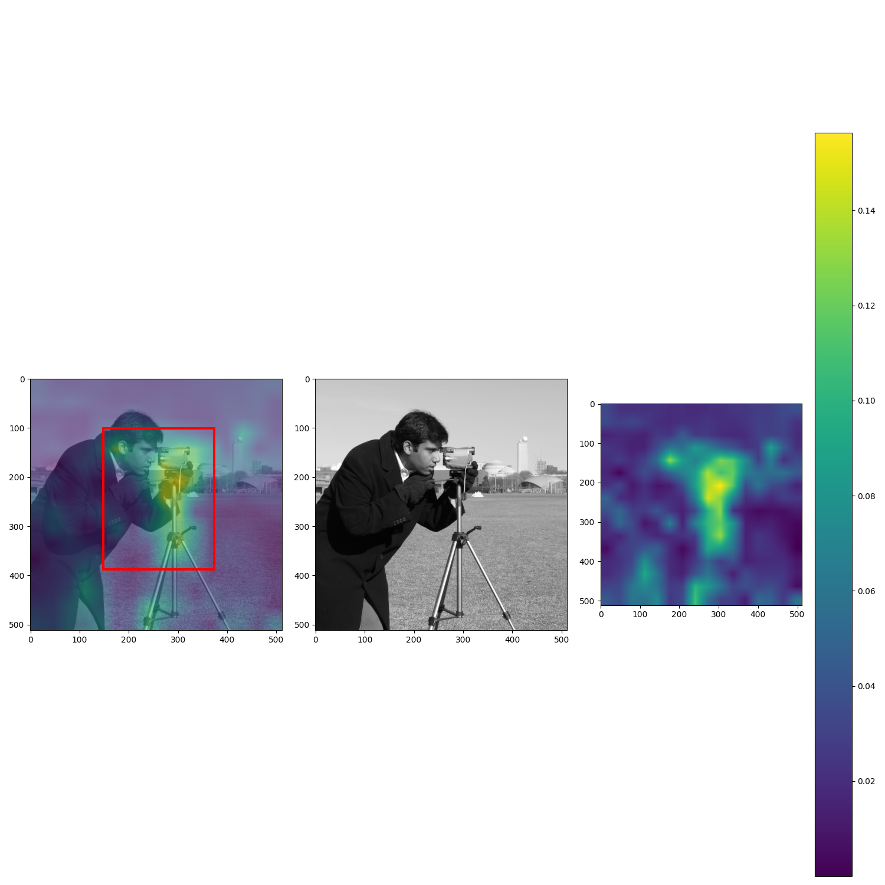

# CLIP_BBox

`CLIP_BBox` is a Python library for detecting image objects with natural language text labels. 

[](https://github.com/graceduansu/clip_bbox/actions?query=workflow%3A%22Build+Status%22)
[](https://codecov.io/gh/graceduansu/clip_bbox)
[](./LICENSE)

[](https://pypi.org/project/clip-bbox/)
[](https://clip-bbox.readthedocs.io)


## Overview / About

[CLIP](https://github.com/openai/CLIP) is a neural network, pretrained on image-text pairs, that can predict the most relevant text snippet for a given image. 

Given an image and a natural language text label, `CLIP_BBox` will obtain the image's spatial embedding and text label's embedding from CLIP, compute the similarity heatmap between the embeddings, then draw bounding boxes around the image regions with the highest image-text correspondences. 

## Note
The files for building the CLIP model (`clip.py`, `model.py`, `newpad.py`, `simple_tokenizer.py`) are third-party code from the [CLIP repo](https://github.com/openai/CLIP). They are not included in test coverage.

### Features

The library provides functions for the following operations:
* Getting and appropriately reshaping an image's spatial embedding from the CLIP model before it performs attention-pooling
* Getting a text snippet's embedding from CLIP
* Computing the similarity heatmap between an image's spatial and text embeddings from CLIP
* Drawing bounding boxes on an image, given a similarity heatmap

## Install

Use pip to install clip_bbox as a Python package:

    $ pip install clip-bbox

## Usage Examples

### Command Line Script
```
usage: python -m clip_bbox [-h] imgpath caption outpath

positional arguments:
  imgpath     path to input image
  caption     caption of input image
  outpath     path to output image displaying bounding boxes

optional arguments:
  -h, --help  show this help message and exit
```

To draw bounding boxes on an image based on its caption, run

    $ python -m clip_bbox "path/to/img.png" "caption of your image" "path/to/output_path.png"

### Python Module

To draw bounding boxes on an image based on its caption, do the following:

```python
from clip_bbox import run_clip_bbox

run_clip_bbox("path/to/img.png", "caption of your image", "path/to/output_path.png")
```

### Example Output
Here is an example output image for the caption `"a camera on a tripod"`:


